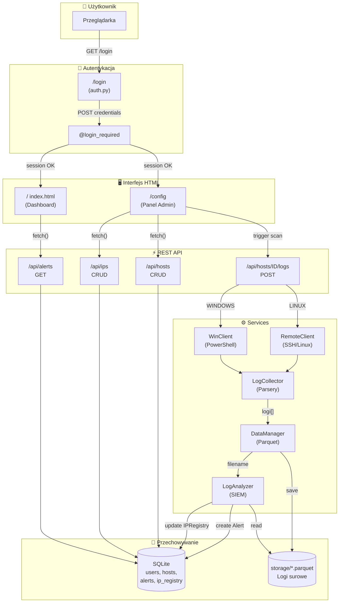

# 📊 Analiza Architektury Mini-SIEM

**Data analizy:** 2026-01-11  
**Wersja:** 1.0

---

## 📁 Przegląd Struktury Projektu

```
mini-siem/
├── app/
│   ├── __init__.py          # Fabryka aplikacji Flask
│   ├── extensions.py        # Rozszerzenia (db, login_manager, csrf)
│   ├── forms.py             # Formularze WTForms
│   ├── models.py            # Modele SQLAlchemy
│   ├── blueprints/
│   │   ├── auth.py          # Logowanie/wylogowanie (HTML)
│   │   ├── ui.py            # Strony dashboard/config
│   │   └── api/
│   │       └── hosts.py     # REST API dla hostów i logów
│   ├── services/
│   │   ├── data_manager.py  # Zapis/odczyt Parquet
│   │   ├── log_analyzer.py  # Analiza zagrożeń (SIEM)
│   │   ├── log_collector.py # Zbieranie logów Linux/Windows
│   │   ├── remote_client.py # Klient SSH (Paramiko)
│   │   └── win_client.py    # Klient PowerShell
│   ├── templates/           # Szablony Jinja2
│   └── static/              # CSS/JS/obrazy
├── config.py                # Konfiguracja Flask
├── OCENA.md                 # Kryteria oceny
└── requirements.txt         # Zależności
```

---

## ✅ Obecne Funkcjonalności (Co Już Działa)

### 1. Infrastruktura Flask
| Komponent | Status | Opis |
|-----------|--------|------|
| `create_app()` | ✅ Gotowe | Fabryka aplikacji z konfiguracją |
| `extensions.py` | ✅ Gotowe | SQLAlchemy, Migrate, LoginManager, CSRFProtect |
| `LoginForm` | ✅ Gotowe | Formularz logowania z walidacją |

### 2. Modele Danych (SQLAlchemy)
| Model | Status | Uwagi |
|-------|--------|-------|
| `User` | ⚠️ Częściowo | Brak hashowania haseł! |
| `Host` | ✅ Gotowe | Pełny CRUD z `to_dict()` |
| `LogSource` | ✅ Gotowe | Relacja z Host |
| `LogArchive` | ✅ Gotowe | Historia pobrań |
| `IPRegistry` | ✅ Gotowe | Threat Intelligence |
| `Alert` | ✅ Gotowe | Model alertów z `to_dict()` |

### 3. API REST (`api/hosts.py`)
| Endpoint | Metoda | Status |
|----------|--------|--------|
| `/api/hosts` | GET | ✅ Działa |
| `/api/hosts` | POST | ✅ Działa |
| `/api/hosts/<id>` | PUT | ✅ Działa |
| `/api/hosts/<id>` | DELETE | ✅ Działa |
| `/api/hosts/<id>/ssh-info` | GET | ✅ Działa |
| `/api/hosts/<id>/windows-info` | GET | ✅ Działa |
| `/api/hosts/<id>/logs` | POST | ❌ Zwraca 501 |
| `/api/ips` | * | ❌ Zakomentowane |
| `/api/alerts` | GET | ❌ Zakomentowane |

### 4. Services (Warstwy Logiki)
| Serwis | Status | Uwagi |
|--------|--------|-------|
| `RemoteClient` | ✅ Gotowe | SSH z context manager |
| `WinClient` | ✅ Gotowe | PowerShell lokalny |
| `LogCollector` | ✅ Gotowe | Parsery Linux/Windows |
| `DataManager` | ✅ Gotowe | Zapis/odczyt Parquet |
| `LogAnalyzer` | ⚠️ Częściowo | TODO w `analyze_parquet()` |

---

## ❌ Brakujące Elementy (Co Trzeba Dać)

### ZADANIE 1: Bezpieczeństwo Użytkowników
```python
# models.py - Linie 13-25
def set_password(self, password):
    # TODO: Zaimplementuj hashowanie hasła
    pass  # <-- PUSTE!

def check_password(self, password):
    # TODO: Zaimplementuj weryfikację hasła
    return True  # <-- ZAWSZE PRAWDA!
```

```python
# auth.py - Linie 16-26
# TODO: ZADANIE 1 - LOGOWANIE
# 1. Pobierz użytkownika z bazy
# 2. Sprawdź hasło
# 3. login_user() lub flash error
flash('Mechanizm logowania nie jest jeszcze zaimplementowany!', 'warning')
```

### ZADANIE 2: Integracja Pobierania Logów
```python
# api/hosts.py - Linia 112-138
@api_bp.route("/hosts/<int:host_id>/logs", methods=["POST"])
def fetch_logs(host_id):
    # TODO: ZADANIE 2 - INTEGRACJA POBIERANIA LOGÓW
    # Obecnie zwraca: 501 Not Implemented
```

**Wymagane kroki:**
1. Sprawdzić `host.os_type` (LINUX vs WINDOWS)
2. Użyć `RemoteClient` lub `WinClient`
3. Wywołać `LogCollector.get_linux_logs()` / `get_windows_logs()`
4. Zapisać do Parquet via `DataManager.save_logs_to_parquet()`
5. Zaktualizować `LogSource.last_fetch`
6. Dodać wpis do `LogArchive`
7. Wywołać `LogAnalyzer.analyze_parquet()`

### ZADANIE 3: API dla IPRegistry i Alertów
```python
# api/hosts.py - Linie 145-169
# Wszystkie endpointy są ZAKOMENTOWANE:
# - GET/POST /api/ips
# - PUT/DELETE /api/ips/<id>
# - GET /api/alerts
```

### ZADANIE 3: Logika SIEM (Threat Intelligence)
```python
# log_analyzer.py - Linie 46-73
# TODO: ZADANIE 3 - LOGIKA SIEM (THREAT INTELLIGENCE)
# 1. Sprawdź IP w IPRegistry
# 2. Dodaj/aktualizuj wpis
# 3. Ustal severity na podstawie statusu IP
# 4. Stwórz Alert
pass  # <-- NIEPEŁNA IMPLEMENTACJA
```

---

## 🔓 Luki Bezpieczeństwa

### KRYTYCZNE 🚨

| Luka | Lokalizacja | Problem | Rozwiązanie |
|------|-------------|---------|-------------|
| **Brak hashowania haseł** | `models.py:17` | `set_password()` jest puste | Użyć `generate_password_hash()` |
| **Bypass weryfikacji** | `models.py:25` | `check_password()` zwraca zawsze `True` | Użyć `check_password_hash()` |
| **Brak `@login_required` w UI** | `ui.py:12-15` | `/config` dostępna bez logowania | Dodać dekorator |
| **Brak `@login_required` w API** | `api/hosts.py` | WSZYSTKIE endpointy bez autoryzacji | Dodać do każdego route |

### SZCZEGÓŁY API BEZ ZABEZPIECZEŃ

```python
# api/hosts.py - Brak @login_required na:
@api_bp.route("/hosts", methods=["GET"])       # Linia 18
@api_bp.route("/hosts", methods=["POST"])      # Linia 23
@api_bp.route("/hosts/<id>", methods=["DELETE"])  # Linia 34
@api_bp.route("/hosts/<id>", methods=["PUT"])     # Linia 41
@api_bp.route("/hosts/<id>/ssh-info")          # Linia 53
@api_bp.route("/hosts/<id>/windows-info")      # Linia 82
@api_bp.route("/hosts/<id>/logs")              # Linia 112
```

> [!CAUTION]
> **Dlaczego to krytyczne?**  
> Zabezpieczenie przycisku "Usuń" w HTML to **security through obscurity**.  
> Atakujący może wywołać `DELETE /api/hosts/1` z Postmana/curl bez logowania!
> Frontend (HTML/JS) to tylko wygoda użytkownika, backend musi samodzielnie pilnować autoryzacji.

---

## 🎯 Wyzwania Techniczne (Najtrudniejsze Elementy)

### 1. Rozgałęzienie OS w `fetch_logs()` 🔀
```
if host.os_type == "LINUX":
    → RemoteClient (SSH) → LogCollector.get_linux_logs()
elif host.os_type == "WINDOWS":
    → WinClient (PowerShell) → LogCollector.get_windows_logs()
```
**Wyzwanie:** Poprawna obsługa błędów połączenia SSH/PowerShell bez zatrzymywania całego procesu.

### 2. Korelacja IP z Threat Intelligence 🧠
```
IP w logu → Sprawdź IPRegistry → Ustal severity
              ↓ nie ma          ↓ jest (status?)
           Dodaj UNKNOWN       BANNED → CRITICAL
                               TRUSTED → pomiń/INFO
```
**Wyzwanie:** Logika warunkowa + aktualizacja `last_seen`.

### 3. Spójność transakcji DB 💾
```python
# Musi być atomowe:
log_source.last_fetch = datetime.now()
db.session.add(LogArchive(...))
db.session.add(Alert(...))
db.session.commit()  # Jeden commit na końcu!
```

### 4. Obsługa CSRF dla API 🛡️
```python
# __init__.py - Linia 35
csrf.exempt(api_bp)  # To jest "zadanie z gwiazdką"
```
**Wyzwanie (opcjonalne):** Usunięcie tego i obsługa tokenów CSRF w JS.

---

## 📊 Diagram Flow: User → Baza



---

## 📋 3 Najkrytyczniejsze Punkty z OCENA.md

> [!IMPORTANT]
> ### 1. 🔑 Hashowanie Haseł (40% oceny - SECURITY)
> **Cytat:** *"✅ [Krytyczne] Hasła w bazie są zahashowane (werkzeug.security). Przechowywanie plain-text to automatyczne 2.0."*
> 
> **Status:** ❌ NIEZAIMPLEMENTOWANE  
> **Plik:** `models.py` (linie 13-17, 19-25)  
> **Wymagane:** `generate_password_hash()` + `check_password_hash()`

> [!IMPORTANT]
> ### 2. 🛡️ Zabezpieczenie API (40% oceny - SECURITY)
> **Cytat:** *"✅ [Krytyczne] API (api/hosts.py) jest zabezpieczone. Student musi rozumieć, dlaczego zabezpieczenie samego HTML (ui.py) nie wystarcza."*
> 
> **Status:** ❌ NIEZAIMPLEMENTOWANE  
> **Plik:** `api/hosts.py` (wszystkie endpointy)  
> **Wymagane:** `@login_required` na każdym route

> [!IMPORTANT]
> ### 3. 💾 Zapis Logów do Parquet (30% oceny - FORENSICS)
> **Cytat:** *"✅ [Forensics] Logi są zapisywane do pliku Parquet przed analizą. Rozwiązania, które analizują dane tylko w RAM (bez zapisu), są niezgodne ze specyfikacją (utrata dowodów)."*
> 
> **Status:** ❌ NIEZAIMPLEMENTOWANE  
> **Plik:** `api/hosts.py` (linia 112-138)  
> **Wymagane:** Integracja `DataManager.save_logs_to_parquet()` przed `LogAnalyzer.analyze_parquet()`

---

## 🔍 Kluczowe Rozróżnienia

### Logowanie HTML vs Logowanie API

| Aspekt | HTML (`ui.py`, `auth.py`) | API (`api/hosts.py`) |
|--------|---------------------------|----------------------|
| **Cel** | Wizualne strony dla człowieka | Dane JSON dla JavaScript |
| **Zabezpieczenie** | `@login_required` + redirect | `@login_required` + JSON error |
| **Kto używa** | Przeglądarka (klikanie) | `fetch()` z JS / curl / Postman |
| **Obejście** | Trudne (sesja w cookies) | **TRYWIALNE** jeśli brak ochrony! |

> [!WARNING]
> **Dlaczego oba muszą być zabezpieczone:**  
> HTML to tylko "fasada". Prawdziwe operacje (usuwanie hostów, pobieranie logów) wykonuje API.  
> Atakujący nie musi widzieć Twojego UI – wystarczy, że zna endpoint API.

### Tabele Ręczne vs Automatyczne

| Typ | Tabele | Kto zarządza | Jak |
|-----|--------|--------------|-----|
| **Ręczne** | `hosts`, `users`, `ip_registry` | Admin przez UI/API | CRUD endpointy |
| **Automatyczne** | `log_sources`, `log_archives`, `alerts` | System SIEM | Automatycznie w `fetch_logs()` + `LogAnalyzer` |

```
User dodaje host → Host.create()
                         ↓
System skanuje logi → LogSource.update(last_fetch)
                         ↓
                    LogArchive.create()
                         ↓
                    Alert.create() (jeśli zagrożenie)
```

---

## 📝 Lista Plików do Modyfikacji

### MUSZĄ BYĆ ZMODYFIKOWANE ✏️

| Plik | Zadanie | Zmiany |
|------|---------|--------|
| `app/models.py` | ZADANIE 1 | Implementacja `set_password()` i `check_password()` |
| `app/blueprints/auth.py` | ZADANIE 1 | Implementacja logiki logowania w `login()` |
| `app/blueprints/ui.py` | SECURITY | Dodanie `@login_required` do `config()` |
| `app/blueprints/api/hosts.py` | ZADANIE 2+3, SECURITY | Implementacja `fetch_logs()`, odblokowanie endpointów IP/alerts, dodanie `@login_required` |
| `app/services/log_analyzer.py` | ZADANIE 3 | Implementacja logiki Threat Intelligence w `analyze_parquet()` |

### MOGĄ POZOSTAĆ NIEZMIENIONE ✅

| Plik | Powód |
|------|-------|
| `app/__init__.py` | W pełni skonfigurowane |
| `app/extensions.py` | Wszystkie rozszerzenia działają |
| `app/forms.py` | Formularz gotowy |
| `app/services/data_manager.py` | Gotowe metody Parquet |
| `app/services/log_collector.py` | Kompletne parsery Linux/Windows |
| `app/services/remote_client.py` | Gotowy klient SSH |
| `app/services/win_client.py` | Gotowy klient PowerShell |
| `config.py` | Konfiguracja kompletna |
| `requirements.txt` | Zależności kompletne |

### SZABLONY (opcjonalnie)

| Plik | Status | Uwagi |
|------|--------|-------|
| `templates/base.html` | Prawdopodobnie OK | Może wymagać dodania motywu |
| `templates/config.html` | Zależy od implementacji | Może wymagać poprawek JS dla nowych endpointów |
| `templates/index.html` | Zależy od implementacji | Dashboard alertów |

---

## 🚀 Proponowana Kolejność Implementacji

```
1. ZADANIE 1 (Security First)
   └─ models.py → auth.py → ui.py

2. ZABEZPIECZENIE API
   └─ api/hosts.py (wszystkie @login_required)

3. ZADANIE 2 (Log Collection)
   └─ api/hosts.py:fetch_logs()

4. ZADANIE 3 (SIEM Logic)
   └─ log_analyzer.py → api/hosts.py (endpoints IP/alerts)

5. ZADANIA Z GWIAZDKĄ (opcjonalne)
   └─ Bootswatch / Dark Mode / CSRF
```

---

## ⚠️ Ostrzeżenia dla Implementującego

1. **NIE usuwaj `csrf.exempt(api_bp)`** dopóki nie zaimplementujesz obsługi tokenów CSRF w JavaScript (to zadanie z gwiazdką).

2. **Jeden `db.session.commit()` na końcu transakcji**, nie po każdej operacji.

3. **Ogólny komunikat błędu logowania** - nie zdradzaj, czy login czy hasło są złe.

4. **Testuj z `test_real_ssh_logs.py`** i `test_windows_logs.py` - to dokumentacja użycia serwisów.

5. **Sprawdź `__init__.py`** blueprintów - może być pusty, ale musi istnieć.

---

*Dokument wygenerowany automatycznie przez analizę statyczną kodu.*
